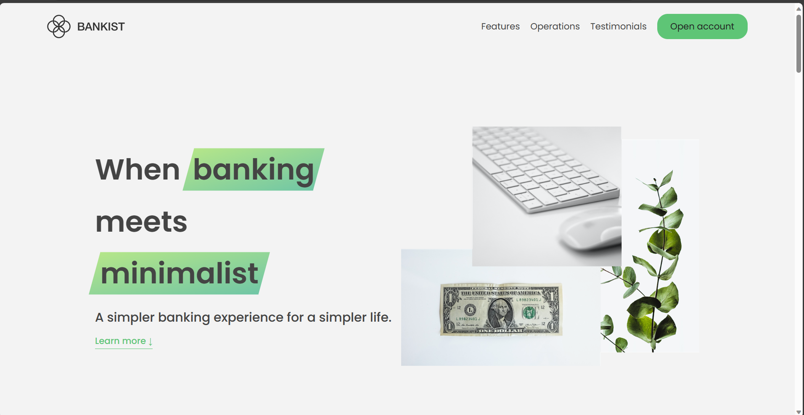
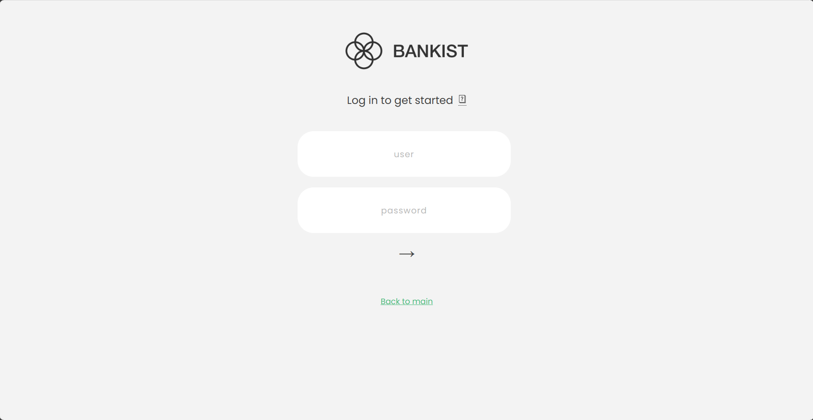
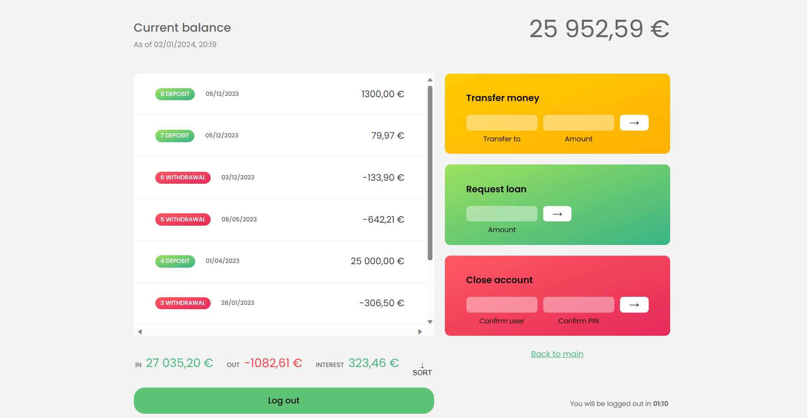

# Bankist

<a href="https://bankist-v2-web-app.vercel.app/">Bankist</a> is a fictional and minimalistic online banking application.

Everything you need in a modern bank and more.
· 100% digital bank
· Watch your money grow
· Free debit card included.

## What is Bankist?

Bankist is a fictional online bank. It is a project introduced by <a href="https://github.com/jonasschmedtmann">Jonas Schmedtmann</a> in order to practice DOM manipulation and user interaction. Bankist has the option to log in to the account and use different functionalities, almost like in an actual bank!

## Functionalities

- Login
- Transfer a value to another account
- Get loans
- Close (delete) account

## Login Details

This is the template login details to use the bank functionality. The project does not include any backend and does not have an actual registration functionality. Make sure to use usernames are lowercase!

#### Account One

- Login: js
- Password: 1111

#### Account Two

- Login: jd
- Password: 2222

#### Account Three

- Login: kr
- Password: 3333

#### Account four

- Login: sr
- Password: 4444

#### Screen shots

##### welcome page

##### log in page

##### user account

## Technologies Used

- HTML
- CSS
- Vanilla JavaScript

## Contribution

This project serves as a project to show off my personal skills. I do not accept any contributions like pull requests to this project however if you have any suggestions or ideas feel free to message me . Otherwise, you are free to fork this project and change it for your own purposes.
